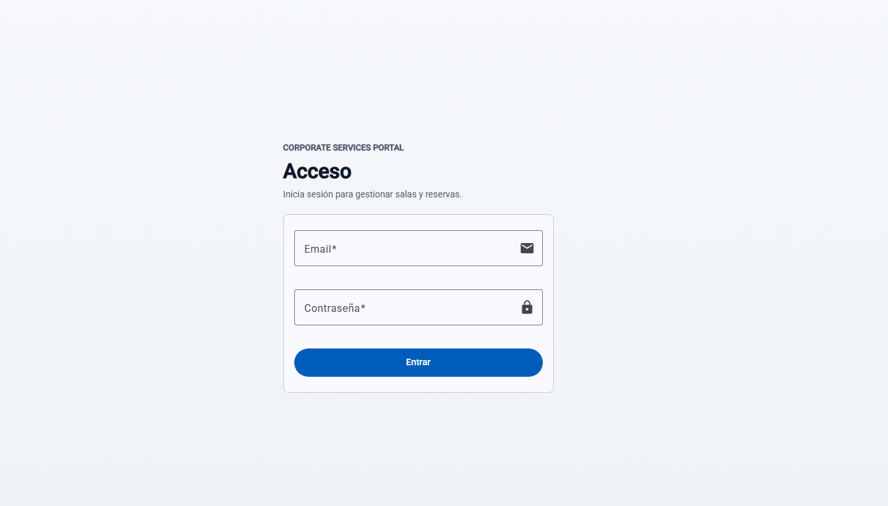
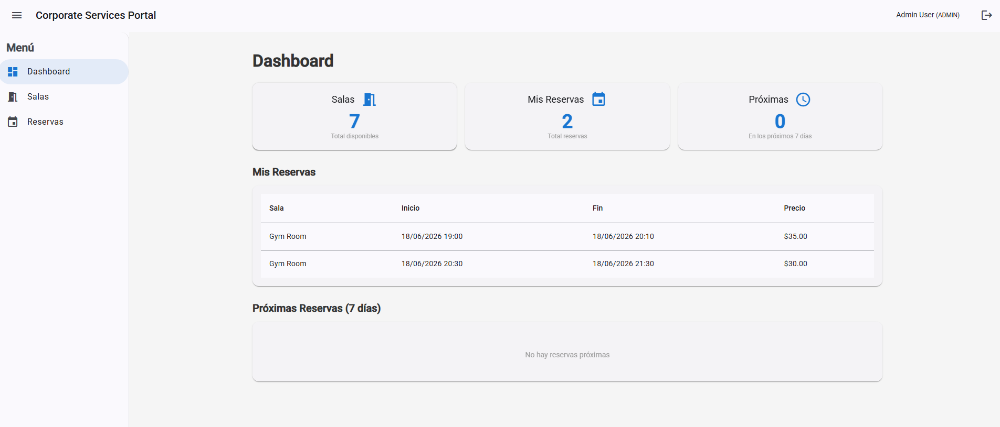
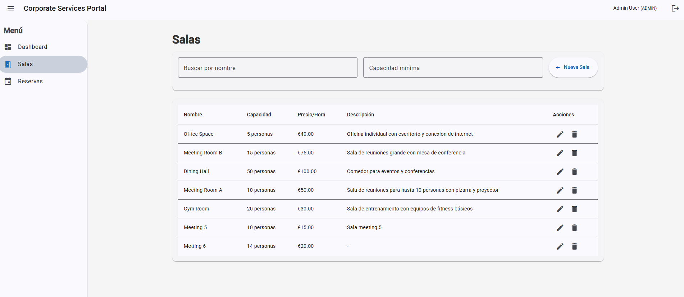
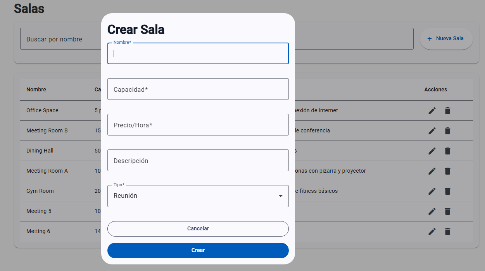
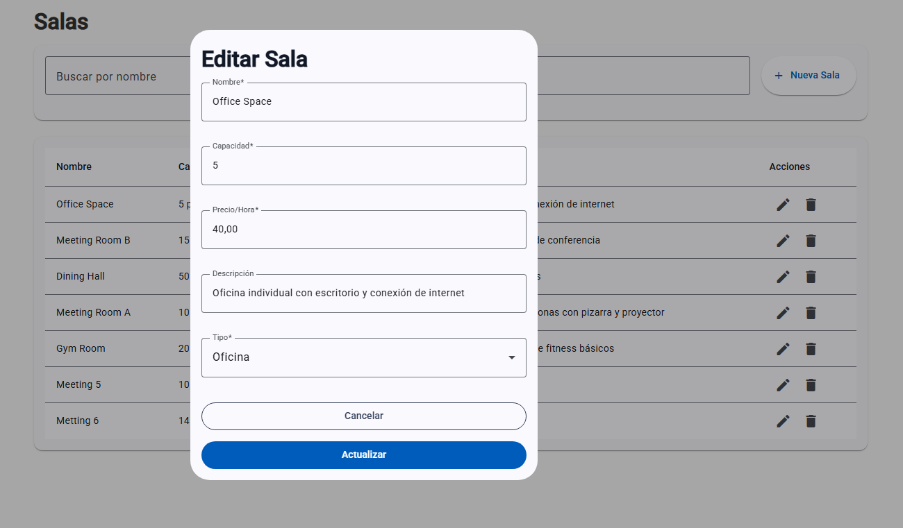
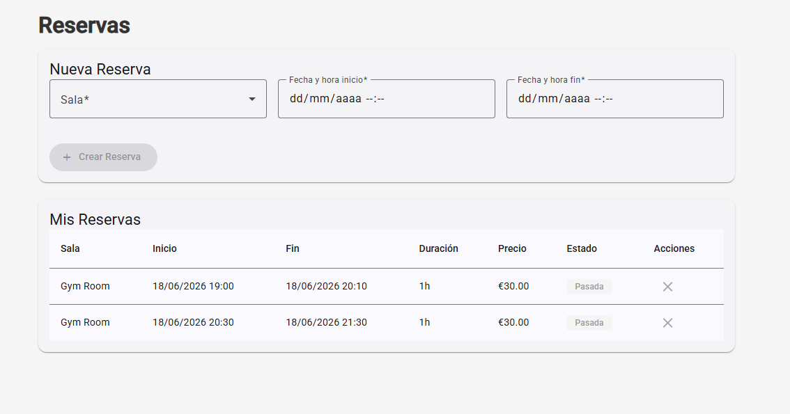

# Corporate Services Portal

Portal web para gestionar espacios y reservas de servicios corporativos.

El proyecto está organizado como un monorepo con tres bloques principales:

- `backend/api`: API en NestJS conectada a PostgreSQL.
- `frontend/web`: interfaz web en Angular.
- `infra`: infraestructura local con Docker Compose.

## 🧭 Visión general

- El backend expone una API REST bajo el prefijo `/api`.
- La documentación interactiva está disponible en `/docs`.
- El frontend consume la API y protege el acceso a las pantallas internas mediante autenticación.
- La base de datos es PostgreSQL.

## ✨ Funcionalidades principales

- Autenticación de usuarios.
- Gestión de salas.
- Gestión de reservas.
- Panel de dashboard.

## 🛠️ Tecnologías

- NestJS
- Angular
- PostgreSQL
- TypeORM
- JWT
- Swagger
- Docker

## 📋 Requisitos previos

- Node.js instalado.
- npm instalado.
- Docker Desktop instalado si quieres levantar la base de datos o todo el stack con contenedores.

## 📁 Estructura del proyecto

```text
backend/
  api/        # API NestJS
frontend/
  web/        # Aplicación Angular
infra/
  docker-compose.yml
```

## 🚀 Ejecución local

Si quieres trabajar con la base de datos en Docker y ejecutar la API y el frontend en local, este es el flujo recomendado:

### 1. Levantar la base de datos

Desde la carpeta `infra/`:

```bash
docker compose up -d db
```

Si prefieres ejecutarlo desde la raíz del proyecto:

```bash
docker compose -f infra/docker-compose.yml up -d db
```

### 2. Levantar el backend

En una nueva terminal:

```bash
cd backend/api
npm install
npm run start:dev
```

El backend queda disponible en:

- API: `http://localhost:3000/api`
- Swagger: `http://localhost:3000/docs`

### 3. Levantar el frontend

En otra terminal:

```bash
cd frontend/web
npm install
npm start
```

La aplicación queda disponible en:

- Frontend: `http://localhost:4200`

## 🐳 Ejecución con Docker

Si quieres levantar toda la plataforma con un solo comando:

```bash
docker compose -f infra/docker-compose.yml up --build
```

Servicios expuestos:

- PostgreSQL: `localhost:5434`
- API: `http://localhost:3000`
- Frontend: `http://localhost:4200`


## 🖥️ Rutas principales del frontend

- `/login`: pantalla de acceso.

- `/dashboard`: panel principal.

- `/rooms`: listado de salas.

- `/rooms (new)`: alta de sala.

- `/rooms (edit)`: edición de sala.

- `/reservations`: listado de reservas.


## 🔌 API principal

Algunas rutas relevantes del backend:

- `POST /api/auth/register`
- `POST /api/auth/login`
- `GET /api/auth/me`
- `GET /api/rooms`
- `POST /api/rooms`
- `GET /api/rooms/:id`
- `GET /api/reservations`
- `POST /api/reservations`
- `GET /api/reservations/me`

